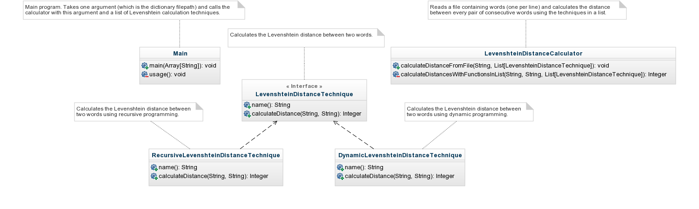

[](https://www.codacy.com/app/sallareznov/gc-levenshtein)
[](https://codeclimate.com/github/sallareznov/gc-levenshtein)

<p align="center">
  
</p>

# Energy footprint of the Levenshtein distance computing algorithm

### Author
* Salla DIAGNE ([sallareznov](https://github.com/sallareznov))

(You can read the full report with the results by browsing the repository https://github.com/sallareznov/gc-levenshtein-report ([report/report.pdf](https://github.com/sallareznov/gc-levenshtein-report/blob/master/report.pdf))).

### The goal

The goal of this project is to measure and compare energy footprints of multiple languages through programs executing the same task.

### The tool
To get those metrics, the project uses [PowerAPI](http://powerapi.org), a middleware toolkit for building software-defined power meters. Software-defined power meters are configurable software libraries that can estimate the power consumption of software in real-time.

### The algorithm
This algorithm, implemented in multiple languages, reads a dictionary of words in a text file (one word per line), and calculates the Levenshtein distance between all consecutive words. This computation is done in two ways : recursively, and iteratively (using dynamic programming).

Every program takes one argument, which is a file path of a dictionary containing one word per line.
* reads a file containing one word per line
* for every pair of consecutive words, calculates the Levenshtein distance recursively and iteratively.

The design of the program is the following :

<p align="center">
  
</p>

The algorithm follows this flowchart :

<p align="center">
  
</p>

### The program

Every implemented program requires one argument, referencing the dictionary of words (one word per line). For example, to use the program implemented in Ocaml with the dictionary file in the repository, you have to execute the following commands :

```
$ cd ocaml
$ make
$ ./levenshtein ../dictionary.txt
```

### The languages
In alphabetical order, the algorithm is implemented in :

* C
* Go
* Java
* Ocaml
* Python
* Scala
